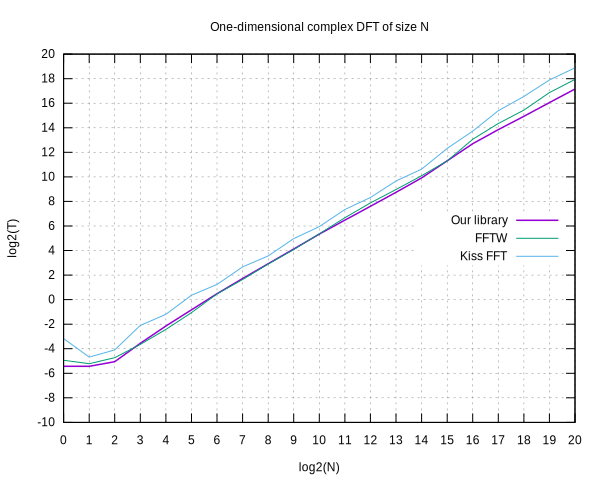

# minfft
A minimalistic Fast Fourier Transform library.

Its goal is to achieve high performance by simple means.

## Overview
The library provides routines for computing:

* Forward and inverse complex DFT,
* Real symmetric transforms (DCT and DST) of the types 2, 3, and 4

of any dimensionality and power-of-two lengths.

## Contents
- [Interface](#interface)
- [Transforms](#transforms)
  - [Complex DFT](#complex-dft)
  - [Inverse complex DFT](#inverse-complex-dft)
  - [DCT-2](#dct-2)
  - [DST-2](#dst-2)
  - [DCT-3](#dct-3)
  - [DST-3](#dst-3)
  - [DCT-4](#dct-4)
  - [DST-4](#dst-4)
- [Memory requirements](#memory-requirements)
- [Implementation details](#implementation-details)
- [Performance](#performance)
- [Test environment](#test-environment)
- [Conformance](#conformance)
- [License](#license)

## Interface
All transform routines take three arguments:

* a pointer to the input data `x`,
* a pointer to the output data `y`,
* a pointer to the *auxiliary structure* `a`.

The transform routines are capable of both in-place and out-out-place
operation. In the latter case the input data would be left intact.

An auxiliary structure contains chains of precomputed constants and
temporary memory buffers required by a transform routine to do its job.

The library contains functions for preparing auxiliary structures for
all transforms. Once prepared, an auxiliary structure can be reused as
many times as needed. Also, the same auxiliary structure fits for both
forward and inverse transforms of the same kind.

The memory consumed by the auxiliary data can be freed by the
`minfft_free_aux()` routine.

Here is an example to give you a feeling how the library functions are
used:
```C
	double complex x[N],y[N];
	// prepare aux structure
	struct minfft_aux *a = minfft_aux_dft_1d(N);
	// do transforms
	minfft_dft(x,y,a);
	minfft_invdft(y,x,a);
	// free aux data
	minfft_free_aux(a);
```

## Transforms
Below is a list of transform functions and their auxiliary data
makers. For convenience, we provide makers for one-, two-, and
three-dimensional transforms, along with a generic any-dimensional one.

Also we give a formal definition of each transform for the
one-dimensional case.

Our definitions of transforms, and input and output data format of the
transform routines, are fully compatible with FFTW.

### Complex DFT

```C
struct minfft_aux* minfft_aux_dft_1d (int N);
struct minfft_aux* minfft_aux_dft_2d (int N1, int N2);
struct minfft_aux* minfft_aux_dft_3d (int N1, int N2, int N3);
struct minfft_aux* minfft_aux_dft (int d, int *Ns);
void minfft_dft (double complex *x, double complex *y, const struct minfft_aux *a);
```

### Inverse complex DFT

```C
struct minfft_aux* minfft_aux_dft_1d (int N);
struct minfft_aux* minfft_aux_dft_2d (int N1, int N2);
struct minfft_aux* minfft_aux_dft_3d (int N1, int N2, int N3);
struct minfft_aux* minfft_aux_dft (int d, int *Ns);
void minfft_invdft (double complex *x, double complex *y, const struct minfft_aux *a);
```

#### DCT-2

```C
struct minfft_aux* minfft_aux_t2t3_1d (int N);
struct minfft_aux* minfft_aux_t2t3_2d (int N1, int N2);
struct minfft_aux* minfft_aux_t2t3_3d (int N1, int N2, int N3);
struct minfft_aux* minfft_aux_t2t3 (int d, int *Ns);
void minfft_dct2 (double *x, double *y, const struct minfft_aux *a);
```

#### DST-2

```C
struct minfft_aux* minfft_aux_t2t3_1d (int N);
struct minfft_aux* minfft_aux_t2t3_2d (int N1, int N2);
struct minfft_aux* minfft_aux_t2t3_3d (int N1, int N2, int N3);
struct minfft_aux* minfft_aux_t2t3 (int d, int *Ns);
void minfft_dst2 (double *x, double *y, const struct minfft_aux *a);
```

#### DCT-3

```C
struct minfft_aux* minfft_aux_t2t3_1d (int N);
struct minfft_aux* minfft_aux_t2t3_2d (int N1, int N2);
struct minfft_aux* minfft_aux_t2t3_3d (int N1, int N2, int N3);
struct minfft_aux* minfft_aux_t2t3 (int d, int *Ns);
void minfft_dct3 (double *x, double *y, const struct minfft_aux *a);
```

#### DST-3

```C
struct minfft_aux* minfft_aux_t2t3_1d (int N);
struct minfft_aux* minfft_aux_t2t3_2d (int N1, int N2);
struct minfft_aux* minfft_aux_t2t3_3d (int N1, int N2, int N3);
struct minfft_aux* minfft_aux_t2t3 (int d, int *Ns);
void minfft_dst3 (double *x, double *y, const struct minfft_aux *a);
```

#### DCT-4

```C
struct minfft_aux* minfft_aux_t4_1d (int N);
struct minfft_aux* minfft_aux_t4_2d (int N1, int N2);
struct minfft_aux* minfft_aux_t4_3d (int N1, int N2, int N3);
struct minfft_aux* minfft_aux_t4 (int d, int *Ns);
void minfft_dct4 (double *x, double *y, const struct minfft_aux *a);
```

#### DST-4

```C
struct minfft_aux* minfft_aux_t4_1d (int N);
struct minfft_aux* minfft_aux_t4_2d (int N1, int N2);
struct minfft_aux* minfft_aux_t4_3d (int N1, int N2, int N3);
struct minfft_aux* minfft_aux_t4 (int d, int *Ns);
void minfft_dst4 (double *x, double *y, const struct minfft_aux *a);
```

## Memory requirements
The amounts of memory allocated inside the auxiliary structures of the
one-dimensional transforms are given below:

Transform                                | Auxiliary data size
-----------------------------------------|---------------------
Complex DFT of length `N`                | `2N` complex numbers
Type-2 or Type-3 transform of length `N` | `4.5N` real numbers
Type-4 transform of length `N`           | `6N` real numbers

Multi-dimensional transforms use a temporary buffer of the same size as
the input data. This value is the dominant term in their auxiliary data
size.

## Implementation details
The complex DFT is computed by a split-radix (2/4), decimation in
frequency, explicitly recursive fast Fourier transform. This method
achieves a remarkable balance between performance and simplicity, and it
behaves particularly cache-friendly, since it refers mostly to adjacent
memory locations.

The real transforms are reduced eventually to a half-length complex
transform.

For each transform, we first implement its one-dimensional,
out-of-place, input-preserving, sequential input, strided output
routine. This allows us to compute a multi-dimensional transform by
repeated application of its one-dimensional routine along each
dimension.

## Performance
Below is a plot of the execution times of our one-dimensional complex
DFT routine compared with FFTW and Kiss FFT. The results are measured
in microseconds per call.



## Test environment
The libraries being compared are built with the GNU C compiler version
8.1.1 for the x86_64 platform. The only optimization option set is
`-Ofast`.

The version of FFTW used is 3.3.8. To make a fair comparison, we disable
all its SIMD optimizations, and therefore compare performance of the
machine-independent code. FFTW plans are created with the option
FFTW_ESTIMATE.

The version of Kiss FFT used is 1.3.0.

The performance measurements are made on an isolated core of an Intel®
Celeron® N3050 CPU running at 2160 MHz.

The results of many performance and precision tests, along with the
program used to conduct them, are available in the `tests` subdirectory.

## Conformance
The source code conforms to the C99 standard.

## License
The library is in the public domain.
