# fourier
A library for computing discrete Fourier transforms.

## Overview
The library computes most widely used 1-dimensional transforms:

* Generic complex DFT and its inverse,
* DFT of real values and its inverse,
* Real symmetric transforms (DCT and DST) of types 2, 3, and 4.

## Interface
The transform functions take four arguments:

* transform length `N` (a power of 2),
* pointer to the input vector `x` (its values will be destroyed),
* pointer to the output vector `y`,
* pointer to the constant *exponent vector* `e`.

The exponent vector contains precomputed constants for the given
transform type and length. The library provides functions for allocating
and filling the exponent vectors for each transform type.

## Usage
Here goes a description of every transform function (along with its
exponent vector generator) with a short explanation of what it
computes.

### Generic complex DFT
```C
void dft (int N, complex *x, complex *y, const complex *e);
complex* mkexp_dft (int N);
```
The function computes the generic complex DFT, defined as usual:

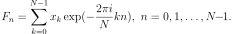

### Inverse complex DFT
```C
void idft (int N, complex *x, complex *y, const complex *e);
complex* mkexp_idft (int N);
```
It computes an unnormalized inverse of the complex DFT (that is, N times
the inverse).

### Real DFT
```C
void realdft (int N, double *x, double *y, const complex *e);
complex* mkexp_realdft (int N);
```
This function computes the complex DFT of N reals. Since only half of N
complex outputs are independent, only those values are returned, packed
as follows:

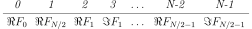

### Inverse real DFT
```C
void irealdft (int N, double *x, double *y, const complex *e);
complex* mkexp_irealdft (int N);
```
It's an unnormalized inverse of the real DFT (N times the inverse). It
expects its input in the same format as `realdft` produces output.

### Real symmetric transforms
These transforms are actually real DFTs of a source vector extended by
symmetry to 4 or 8 times its length. Instead of writing down cumbersome
and unenlightening formulas, we'll show an example of what these
transforms do with a four-element input vector. Everywhere below, `abcd`
is the input vector `x`, and `ABCD` is the output vector `y`. Entries
marked with dots are set to zero.

#### DCT-2
```C
void dct2 (int N, double *x, double *y, const complex *e);
complex* mkexp_t2 (int N);
```
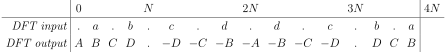

#### DST-2
```C
void dst2 (int N, double *x, double *y, const complex *e);
complex* mkexp_t2 (int N);
```
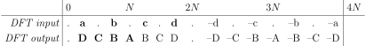

*NB: see [compatibility notes](#notes-on-compatibility).*

#### DCT-3
```C
void dct3 (int N, double *x, double *y, const complex *e);
complex* mkexp_t3 (int N);
```
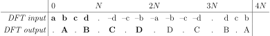

*NB: see [compatibility notes](#notes-on-compatibility).*

#### DST-3
```C
void dst3 (int N, double *x, double *y, const complex *e);
complex* mkexp_t3 (int N);
```
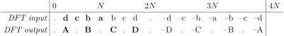

*NB: see [compatibility notes](#notes-on-compatibility).*

#### DCT-4
```C
void dct4 (int N, double *x, double *y, const complex *e);
complex* mkexp_t4 (int N);
```


*NB: see [compatibility notes](#notes-on-compatibility).*

#### DST-4
```C
void dst4 (int N, double *x, double *y, const complex *e);
complex* mkexp_t4 (int N);
```


*NB: see [compatibility notes](#notes-on-compatibility).*

#### Notes on compatibility
Our definitions of real symmetric transforms differ somewhat from the
commonly used ones. Here is the summary of differences between our
definitions and those used in FFTW:

Transform | Difference
----------|-----------
`DCT-2`   | No difference
`DST-2`   | Reverse order of outputs, our transform differs by constant `-1`
`DCT-3`   | Our transform differs by constant `2`
`DST-3`   | Reverse order of inputs, our transform differs by constant `-2`
`DCT-4`   | Our transform differs by constant `2`
`DST-4`   | Our transform differs by constant `-2`

## Implementation details
The generic complex DFT is computed by a split-radix (2/4)
decimation-in-frequency explicitly recursive fast Fourier transform.
This method achieves a remarkable balance between performance and
simplicity, and it behaves particularly cache-friendly, since it mostly
refers to adjacent memory locations.

All the real transforms are reduced eventually to a half-length complex
transform. Let's see how.

Everywhere below,

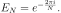.

### Real DFT
Results of the real DFT can be recovered as

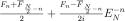

from the results of the complex DFT of length N/2:

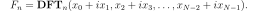.

Inverse real DFT routine simply plays backwards the steps taken by the
forward transform routine.

### Type-2 real symmetric transforms
DCT-2 and DST-2 of length N can be easily reduced to a real DFT of the
same length:

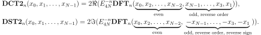

### Type-3 real symmetric transforms
Since the type-3 transforms are inverses (up to a multiple) of their
type-2 counterparts, they are computed by working backwards the steps
taken by the type-2 routines.

### Type-4 real symmetric transforms
Type-4 transforms can be written as

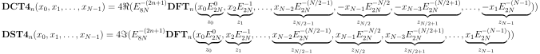

Consider

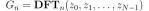

and notice symmetry

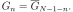.

Therefore, we will know all G if we find those at the even positions.
Luckily, there's a simple way to compute them:

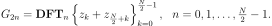.

This way we reduce a type-4 transform to a half-length complex DFT.

## Performance
These graphs show the execution times of our routines compared with
those of FFTW. Timings are plotted with three-sigma error intervals.

### Generic complex DFT
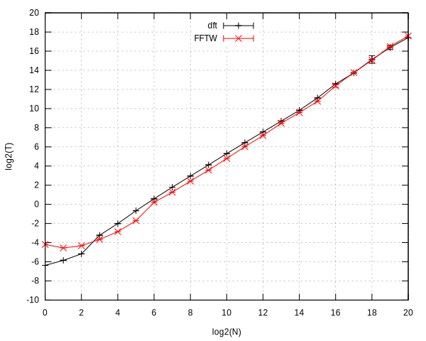

### Real DFT


For the generic complex and real DFTs, our library performs 1.5-2 times
slower than FFTW in most cases. It is not surprising, considering the
sophistication of FFTW, but quite acceptable, taking into account how
much simpler our code is. What is surprising, though, is that our
library manages to perform comparably or significantly better than FFTW
for very big transforms (>65536). In this range, our performance matches
FFTW for the complex DFT, and exceeds it for the real DFT.

Also note as a curiosity, that our library performs much better than
FFTW for very small transforms of sizes 1,2,4.

### DCT-2


### DCT-4
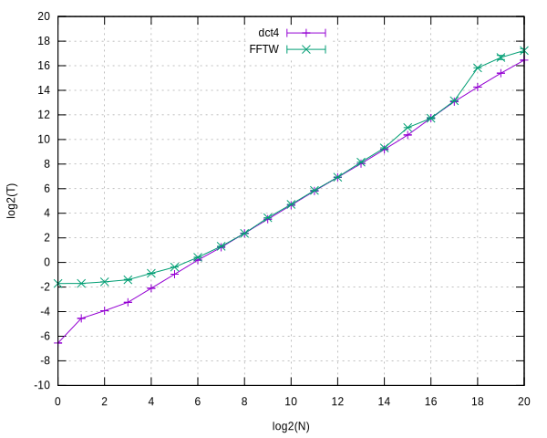

For the real symmetric transforms, our library performs at least as well
as FFTW for most transform sizes, and sometimes much better.

## Precision
This graph shows how much the results of real transforms differ
from the results obtained by direct computation of the underlying
complex DFT. Absent data mean the difference is exactly zero.

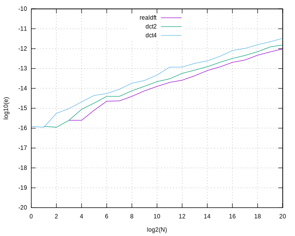

And this graph shows the distribution of an absolute error within the
transform results. Here, the DCT-4 of length N=1024 is compared with its
direct computation by the complex DFT of length 8N:

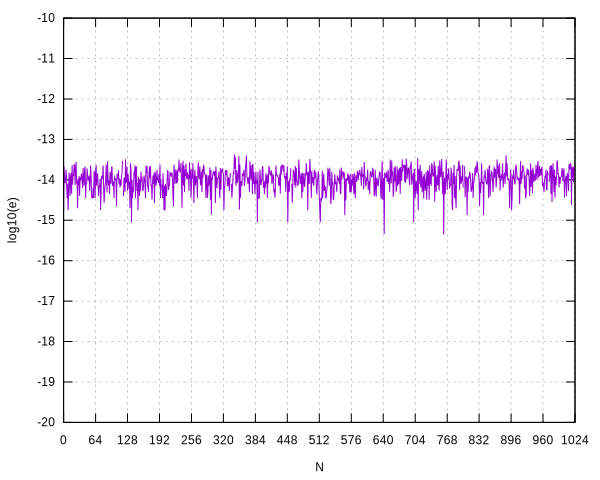

The other transforms exhibit the similar uniform error distribution.

## Test environment
The above tests and comparisons are made with the current library source
compiled with gcc version 7.3.0 on x86_64 with the only optimization
option -Ofast. The version of FFTW used is 3.3.7-1 packed for Arch Linux
x86_64. FFTW plans are created with options FFTW_ESTIMATE and
FFTW_DESTROY_INPUT. The performance measurements are made on an isolated
CPU core.

The source data files for the graphs, along with the program `chkdft.c`
used to conduct the above (and many other) tests, are available in the
`tests` subdirectory.

The `chkdft.c` program contains a lot of examples of library functions
usage, and therefore can serve as a reference.

## Compliance
The source code complies with the C99 standard.

## License
The library is in the public domain.
