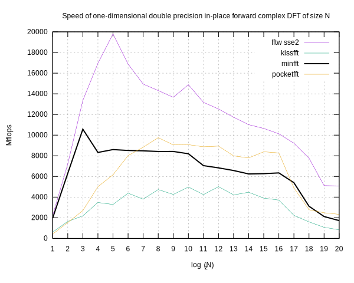
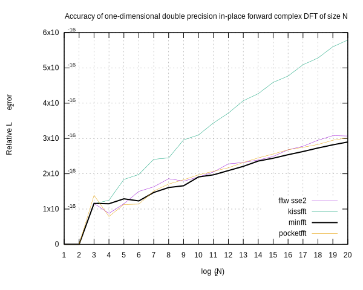

# minfft
A minimalistic Fast Fourier Transform library.

It achieves high performance by simple means.

## Overview

The library routines compute:

* Forward and inverse complex DFT,
* Forward and inverse DFT of real data,
* Cosine and sine transforms of types 2, 3, 4

of any dimensionality and power-of-two lengths.

The library provides C and Fortran interfaces.

## Contents
- [Interface](#interface)
- [Data types](#data-types)
- [Transforms](#transforms)
  - [Complex DFT](#complex-dft)
  - [Inverse complex DFT](#inverse-complex-dft)
  - [Real DFT](#real-dft)
  - [Inverse real DFT](#inverse-real-dft)
  - [DCT-2](#dct-2)
  - [DST-2](#dst-2)
  - [DCT-3](#dct-3)
  - [DST-3](#dst-3)
  - [DCT-4](#dct-4)
  - [DST-4](#dst-4)
- [Freeing auxiliary data](#freeing-auxiliary-data)
- [Memory requirements](#memory-requirements)
- [Implementation details](#implementation-details)
- [Performance](#performance)
- [Test environment](#test-environment)
- [Conformance](#conformance)
- [License](#license)

## Interface
All transform routines take three arguments:

* input data pointer `x`,
* output data pointer `y`,
* auxiliary data pointer `a`.

The transform routines are capable of both in-place and out-of-place
operation. In the latter case the input is left intact.

Auxiliary data contain chains of precomputed constants and temporary
memory buffers, required for a transform routine to do its job. Once
prepared, the auxiliary data can be reused as many times as needed.
Also, the same auxiliary data fit for both forward and inverse
transforms of the same kind.

These examples in C and Fortran show how the library functions are used:

```C
	#include "minfft.h"
	minfft_cmpl x[N],y[N]; // input and output buffers
	minfft_aux *a; // aux data
	// prepare aux data
	a=minfft_mkaux_dft_1d(N);
	// do transforms
	minfft_dft(x,y,a);
	minfft_invdft(y,x,a);
	// free aux data
	minfft_free_aux(a);
```

```Fortran
	use minfft
	complex(minfft_cmpl),dimension(n) :: x,y ! input and output buffers
	type(minfft_aux) :: a ! aux data
	! prepare aux data
	a=minfft_mkaux_dft_1d(n)
	! do transforms
	call minfft_dft(x,y,a)
	call minfft_invdft(y,x,a)
	! free aux data
	call minfft_free_aux(a)
```

## Data types
The library defines its own types for real and complex numbers, and for
auxiliary data:

C             | Fortran
--------------|-----------------------
`minfft_real` | `real(minfft_real)`
`minfft_cmpl` | `complex(minfft_cmpl)`
`minfft_aux`  | `type(minfft_aux)`

By default, `minfft_real` is `double`. If C99 native complex is
available, then `minfft_cmpl` is `double complex`. Otherwise,
`minfft_cmpl` is an array of two `minfft_real`s. It is
binary-compatible with other known complex number types, such as MSVC
`_Dcomplex` or C++ `complex<double>`.

To build single or extended precision versions, define `MINFFT_SINGLE`
or `MINFFT_EXTENDED` macros.

## Transforms
Below is a list of transforms with their definitions, auxiliary data
makers, and transform routines.

For convenience, we provide aux data makers for one-, two- and
three-dimensional transforms, along with a generic any-dimensional one.
The dimensions are passed to aux maker routines in the C order (most
rapidly varying index is the last). So, when calling from Fortran,
array dimensions must be passed in the reverse order:

```Fortran
	complex(minfft_cmpl),dimension(n1,n2,n3) :: z
	a=minfft_mkaux_dft_3d(n3,n2,n1)
```

Auxiliary data makers return NULL if an error occured.

Our definitions of transforms, and formats of input and output data, are
fully compatible with FFTW.

### Complex DFT

```C
minfft_aux* minfft_mkaux_dft_1d (int N);
minfft_aux* minfft_mkaux_dft_2d (int N1, int N2);
minfft_aux* minfft_mkaux_dft_3d (int N1, int N2, int N3);
minfft_aux* minfft_mkaux_dft (int d, int *Ns);
void minfft_dft (minfft_cmpl *x, minfft_cmpl *y, const minfft_aux *a);
```

### Inverse complex DFT

```C
minfft_aux* minfft_mkaux_dft_1d (int N);
minfft_aux* minfft_mkaux_dft_2d (int N1, int N2);
minfft_aux* minfft_mkaux_dft_3d (int N1, int N2, int N3);
minfft_aux* minfft_mkaux_dft (int d, int *Ns);
void minfft_invdft (minfft_cmpl *x, minfft_cmpl *y, const minfft_aux *a);
```

### Real DFT
This transform returns mostly non-redundant part of the complex DFT of
real data.

For a real array of dimensions


it produces a complex array of dimensions


Note that output takes a little more space than input. For in-place
operation, make sure the data buffer is big enough to contain output.

```C
minfft_aux* minfft_mkaux_realdft_1d (int N);
minfft_aux* minfft_mkaux_realdft_2d (int N1, int N2);
minfft_aux* minfft_mkaux_realdft_3d (int N1, int N2, int N3);
minfft_aux* minfft_mkaux_realdft (int d, int *Ns);
void minfft_realdft (minfft_real *x, minfft_cmpl *z, const minfft_aux *a);
```

### Inverse real DFT
This is the inversion of the real DFT.

It takes a complex array of dimensions 


and returns a real array of dimensions


**NB:** Multidimensional inverse real DFT **does not** preserve input.

```C
minfft_aux* minfft_mkaux_realdft_1d (int N);
minfft_aux* minfft_mkaux_realdft_2d (int N1, int N2);
minfft_aux* minfft_mkaux_realdft_3d (int N1, int N2, int N3);
minfft_aux* minfft_mkaux_realdft (int d, int *Ns);
void minfft_invrealdft (minfft_cmpl *z, minfft_real *y, const minfft_aux *a);
```

#### DCT-2

```C
minfft_aux* minfft_mkaux_t2t3_1d (int N);
minfft_aux* minfft_mkaux_t2t3_2d (int N1, int N2);
minfft_aux* minfft_mkaux_t2t3_3d (int N1, int N2, int N3);
minfft_aux* minfft_mkaux_t2t3 (int d, int *Ns);
void minfft_dct2 (minfft_real *x, minfft_real *y, const minfft_aux *a);
```

#### DST-2

```C
minfft_aux* minfft_mkaux_t2t3_1d (int N);
minfft_aux* minfft_mkaux_t2t3_2d (int N1, int N2);
minfft_aux* minfft_mkaux_t2t3_3d (int N1, int N2, int N3);
minfft_aux* minfft_mkaux_t2t3 (int d, int *Ns);
void minfft_dst2 (minfft_real *x, minfft_real *y, const minfft_aux *a);
```

#### DCT-3

```C
minfft_aux* minfft_mkaux_t2t3_1d (int N);
minfft_aux* minfft_mkaux_t2t3_2d (int N1, int N2);
minfft_aux* minfft_mkaux_t2t3_3d (int N1, int N2, int N3);
minfft_aux* minfft_mkaux_t2t3 (int d, int *Ns);
void minfft_dct3 (minfft_real *x, minfft_real *y, const minfft_aux *a);
```

#### DST-3

```C
minfft_aux* minfft_mkaux_t2t3_1d (int N);
minfft_aux* minfft_mkaux_t2t3_2d (int N1, int N2);
minfft_aux* minfft_mkaux_t2t3_3d (int N1, int N2, int N3);
minfft_aux* minfft_mkaux_t2t3 (int d, int *Ns);
void minfft_dst3 (minfft_real *x, minfft_real *y, const minfft_aux *a);
```

#### DCT-4

```C
minfft_aux* minfft_mkaux_t4_1d (int N);
minfft_aux* minfft_mkaux_t4_2d (int N1, int N2);
minfft_aux* minfft_mkaux_t4_3d (int N1, int N2, int N3);
minfft_aux* minfft_mkaux_t4 (int d, int *Ns);
void minfft_dct4 (minfft_real *x, minfft_real *y, const minfft_aux *a);
```

#### DST-4

```C
minfft_aux* minfft_mkaux_t4_1d (int N);
minfft_aux* minfft_mkaux_t4_2d (int N1, int N2);
minfft_aux* minfft_mkaux_t4_3d (int N1, int N2, int N3);
minfft_aux* minfft_mkaux_t4 (int d, int *Ns);
void minfft_dst4 (minfft_real *x, minfft_real *y, const minfft_aux *a);
```

## Freeing auxiliary data
If not needed anymore, the memory consumed by the auxiliary data can
be freed by the `minfft_free_aux()` routine:

```C
void minfft_free_aux (minfft_aux *a);
```

## Memory requirements
Our library does not try to save memory, and allocates temporary buffers
wherever it benefits performance.

The amounts of memory, allocated for the auxiliary data of the
one-dimensional transforms, are given below:

Transform                                | Auxiliary data size
-----------------------------------------|---------------------
Complex DFT of length `N`                | `2N` complex numbers
Real DFT of length `N`                   | `3.5N` real numbers
Type-2 or Type-3 transform of length `N` | `5.5N` real numbers
Type-4 transform of length `N`           | `6N` real numbers

Multi-dimensional transforms use a temporary buffer of the same size as
the input data. This value is the dominant term in their auxiliary data
size.

## Implementation details
The complex DFT is computed by a split-radix (2/4), decimation in
frequency, explicitly recursive fast Fourier transform. This method
achieves a remarkable balance between performance and simplicity, and it
behaves particularly cache-friendly, since it refers mostly to adjacent
memory locations.

The real transforms are reduced eventually to a half-length complex
transform.

For each transform, we first implement its one-dimensional,
out-of-place, input-preserving, sequential input, strided output
routine. This allows us to compute a multi-dimensional transform by
repeated application of its one-dimensional routine along each
dimension.

## Performance
Below are the plots of the speed and accuracy of our library, compared
with the libraries of similar design — KissFFT and PocketFFT.
Performance of a highly optimized machine-specific version of the FFTW
library is also shown for reference.





## Test environment
We use `benchFFT` tool (its current `master` branch) to benchmark our
library and its competitors.

The compiler used is the GNU C compiler version 10.2.1 for the x86_64
platform.

The performance measurements are made on an isolated core of an Intel®
Pentium® Gold G5420 CPU running at 3800 MHz.

## Conformance
The source code conforms to the C99 and Fortran 2003 standards.

## License
MIT.
