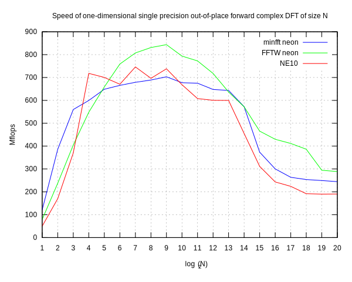
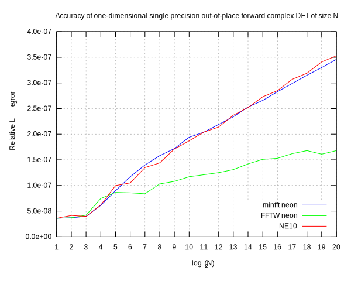

# minfft neon-single

This is a machine-dependent single precision version for the ARM CPUs
with NEON extensions. Most time-consuming parts of the library are
coded manually in assembly language.

## Optimization strategy
The only routines worth manual coding are forward and inverse recursive
strided one-dimensional complex DFTs. They are the main workhorses, to
which all other transforms are ultimately reduced.

The assembly-language code follows the machine-independent C source.
On the low level, two iterations of the main loop are unrolled and
executed in parallel. To facilitate this, we use a slightly modified
format of the exponent vector.

## Performance
Below is a plot of the speed and accuracy of our assembly-language
complex DFT routine, compared with the FFTW library, built with
machine-specific optimizations, and with the Ne10 library.

## Test environment
We use `benchFFT` tool version 3.1 for performance measurements. The
libraries being compared are built with the GNU C compiler version 8.2.0
for the armv7l target. We use FFTW version 3.3.8, and the master branch
of Ne10 (commit `1f059a7..70baa83`). FFTW is configured with
`CFLAGS="-mfpu=neon-vfpv3 -Ofast" ./configure --enable-single
--enable-neon --enable-armv7a-cntvct`. Ne10 is built natively for \*nix
platforms, as its manual prescribes.

The performance measurements are made on an isolated core of an ARMv7
CPU running at 900 MHz.

## Conformance
The assembly-language code uses GAS syntax and follows the ARM
Architecture Procedure Call Standard.

## License
MIT.
