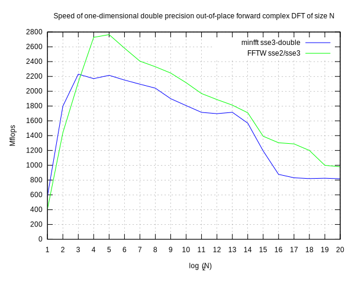
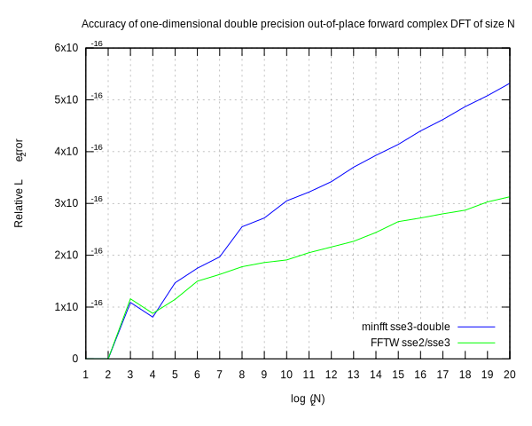

# minfft sse3-double

This is a machine-dependent double precision version for the 64-bit x86
CPUs with SSE3 extensions.  Most time-consuming parts of the library are
coded manually in assembly language.

## Optimization strategy
The only routines worth manual coding are forward and inverse recursive
strided one-dimensional complex DFTs.  They are the main workhorses, to
which all other transforms are ultimately reduced.

The assembly-language code follows the machine-independet C source.
On the low level, two iterations of the main loop are unrolled, and
various kinds of instructions are mixed.  This helps keeping the
execution units busy.

## Performance
Below is a plot of the speed and accuracy of our assembly-language
complex DFT routine, compared with the FFTW library, built with
machine-specific optimizations.

## Test environment
The test program and machine, and the versions of compiler and FFTW are
the same as for the machine-independent code.  FFTW is configured with
`./configure --enable-sse2`.  Our library is built with the
`sse3-double` Makefile target.

## Conformance
The assembly-language code uses AT&T syntax and follows the SystemV
AMD64 ABI calling conventions.

## License
MIT.
